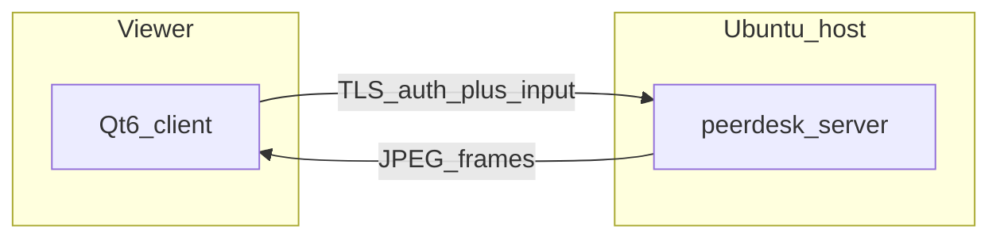

# PeerDesk

Small-team **LAN/VPN remote desktop**: a teammate on macOS or Ubuntu views and controls an **Ubuntu** host with mouse and keyboard, then disconnects and reconnects **without restarting the host server**.

This is a hobby / internal tool (repo nickname “TeamViewer”). The shipped name is **PeerDesk**.



## Show a senior engineer

```bash
cmake -S . -B build && cmake --build build -j
./build/peerdesk-smoke
./scripts/run_demo.sh          # synthetic host canvas
# or: ./scripts/run_demo.sh x11
```

Default login: **jordan** / **peerdesk**. Walkthrough: [docs/DEMO.md](docs/DEMO.md).  
Product memory (journeys, stories, locks): [`.cursor/brain/`](.cursor/brain/).

## What v1 is (and is not)

| In the demo | Explicitly out of scope |
|-------------|-------------------------|
| TLS session, Argon2id + HMAC auth | File transfer, audio, clipboard |
| View primary display (X11 or `--synthetic`) | Wayland host, multi-monitor |
| Mouse + keyboard with coordinate mapping | Relay / “connect from anywhere” |
| One viewer per host; reconnect without restart | Saved profiles, view-only role |

## Build

Needs: CMake, g++/clang C++20, Qt6 Widgets, OpenSSL, libjpeg, libargon2, X11 + XTEST.

```bash
sudo apt install cmake g++ qt6-base-dev libssl-dev libjpeg-dev libargon2-dev \
  libx11-dev libxtst-dev pkg-config
cmake -S . -B build
cmake --build build -j
```

Or use the presets in [`CMakePresets.json`](CMakePresets.json) (CMake ≥ 3.25). In VS Code, CMake Tools
lists them in the status bar: pick a configure preset (**Debug** → `build/`, **Release** → `build-release/`)
and a build preset (all targets or a single one).

```bash
cmake --list-presets=all
cmake --workflow --preset debug        # configure + build all + test
cmake --build --preset debug-server    # one target
ctest --preset debug
```

| Binary | Role |
|--------|------|
| `peerdesk-server` | Ubuntu host (J0) |
| `peerdesk-client` | Viewer UI (J1–J3) |
| `peerdesk-smoke` | Protocol, auth, busy session, reconnect |
| `peerdesk-client-test` | Qt tests: keymap, input mapping, session worker, main window |

## Running the server

The server captures and injects input on whatever X display `$DISPLAY` points at. Run it from the
repo root after building. Default login: **jordan** / **peerdesk**; default port **4473**.

**Synthetic (no display touched).** Draws its own canvas and ignores input. Safe anywhere, including
over NoMachine/SSH:

```bash
./build/peerdesk-server --synthetic --no-inject --port 4473 --data-dir .peerdesk-demo
```

**Isolated X11 desktop (real capture + input, your session untouched).** Run a nested X server with
[Xephyr](https://www.freedesktop.org/wiki/Software/Xephyr/) on a spare display (`:5`) and point the
server at it. Xephyr shows `:5` as a window on your desktop; the server only reads and controls `:5`.

```bash
sudo apt install xserver-xephyr x11-apps xterm   # once
Xephyr :5 -screen 1280x800 -ac -br -noreset &
DISPLAY=:5 xterm &  DISPLAY=:5 xclock &  DISPLAY=:5 xeyes &   # something to look at
DISPLAY=:5 ./build/peerdesk-server --port 4474 --bind 127.0.0.1 --data-dir .peerdesk-demo-x11
```

**Your real desktop.** `./build/peerdesk-server` with no flags uses the current `$DISPLAY`: viewers
see and control your actual screen. Do not do this inside a NoMachine session you are working in.

| Option | Meaning |
|--------|---------|
| `--port N` | Listen port (default 4473) |
| `--bind ADDR` | Listen address (default `0.0.0.0`; use `127.0.0.1` for this machine only) |
| `--data-dir PATH` | Password hashes + self-signed TLS cert (default `~/.peerdesk`) |
| `--user NAME` / `--password STR` | Login created if the store is empty |
| `--synthetic` | Draw a test canvas instead of capturing X11 |
| `--no-inject` | Do not send mouse/keyboard to the host display |
| `--fps N` | Frame rate (default 10) |

**Connect:** run `./build/peerdesk-client` and enter the host IP (`127.0.0.1` locally), the port
(4473 or 4474 above), and the login. Only one viewer at a time; a second gets "session busy".

**Stop:** Ctrl+C in the server terminal (clean shutdown on SIGINT/SIGTERM), close the client window,
then close the Xephyr window (its apps exit with it). The host requires X11; on a Wayland session use
`--synthetic` or the Xephyr setup.

## Architecture (locked)

Native C++ peer desktop. Details and demo-slice shortcuts: [`.cursor/brain/DECISIONS.md`](.cursor/brain/DECISIONS.md).
